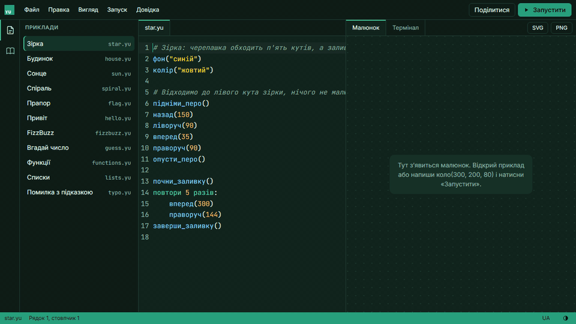

# Yu

[](https://github.com/YuraItDeveloper14/yu/actions/workflows/ci.yml)
[](https://github.com/YuraItDeveloper14/yu/releases/latest)
[](LICENSE)
[](https://yu-lang.vercel.app)

**Мова програмування, яка говорить українською.** Ключові слова й команди мають українську та
англійську назву — пиши як зручно або змішуй. Блоки відступами, як у Python. Помилки пояснюються
по-людськи: де саме, що не так і що, мабуть, малося на увазі.

**Спробувати в браузері: [yu-lang.vercel.app](https://yu-lang.vercel.app)** — Yu Studio: редактор
з меню, як у VS Code, малюнок і термінал в одному вікні, бібліотека всіх слів мови з прикладами;
програми відкриваються й зберігаються як файли `.yu`. Нічого не треба встановлювати.



**Книга Yu: [yu-lang.vercel.app/book](https://yu-lang.vercel.app/book/)** — десять розділів від
першої програми до трьох проєктів і довідник усіх слів, українською та англійською. Кожен приклад
відкривається в Студії одним натисканням, а під прикладами з малюванням видно їхній малюнок. Ті
самі тексти лежать у [`docs/book`](docs/book/README.md), і тест запускає кожен приклад книги та
звіряє його вивід із надрукованим.

*A small programming language that speaks Ukrainian. Every keyword and built-in has a Ukrainian
and an English name, and the two mix freely.*

```
функція факторіал(n):
    якщо n <= 1:
        поверни 1
    поверни n * факторіал(n - 1)

для i від 1 до 5:
    скажи(i, "! =", факторіал(i))
```

```
Помилка в рядку 2: невідома назва «скаж»
  2 | скаж(бал)
    | ^^^^
  Можливо, ти мав на увазі «скажи»?
```

## Встановити

Готовий `yu` для трьох систем, Rust не потрібен:

| Система | Файл |
|---|---|
| Windows 10 і 11 (x64) | [yu-windows-x64.zip](https://github.com/YuraItDeveloper14/yu/releases/latest/download/yu-windows-x64.zip) |
| Linux (x64, будь-який дистрибутив) | [yu-linux-x64.tar.gz](https://github.com/YuraItDeveloper14/yu/releases/latest/download/yu-linux-x64.tar.gz) |
| macOS (Apple Silicon та Intel) | [yu-macos.tar.gz](https://github.com/YuraItDeveloper14/yu/releases/latest/download/yu-macos.tar.gz) |

Розпакуй архів: у папці `yu` лежать сама команда, ця інструкція, ліцензія й приклади. У терміналі
в цій папці `./yu --version` (у PowerShell — `.\yu.exe --version`) надрукує `yu 1.0.0`, а
`./yu examples/star.yu --svg star.svg` намалює зірку.

Суми файлів лежать у [`SHA256SUMS.txt`](https://github.com/YuraItDeveloper14/yu/releases/latest/download/SHA256SUMS.txt).
Щоб перевірити завантажене: на Linux `sha256sum -c SHA256SUMS.txt --ignore-missing`, на macOS
`shasum -a 256 yu-macos.tar.gz`, у PowerShell `Get-FileHash yu-windows-x64.zip` — і порівняй із рядком
у файлі.

Файли не підписані: підпис коштує грошей. Якщо Windows не дає запустити `yu.exe`, виконай у PowerShell
`Unblock-File .\yu.exe`. На macOS у папці з `yu` виконай `xattr -d com.apple.quarantine yu`.

Маєш Rust? Тоді так: `cargo install --git https://github.com/YuraItDeveloper14/yu --tag v1.0.0 yu-cli`.

## Запустити з коду

Потрібен Rust (`rustup`). Далі:

```bash
cargo run -p yu-cli -- examples/fizzbuzz.yu   # запустити програму
cargo run -p yu-cli                           # інтерактивний режим
cargo run -p yu-cli -- --lang en examples/typo.yu
```

## Мова за хвилину

| Українською | English | |
|---|---|---|
| `якщо` / `інакше якщо` / `інакше` | `if` / `else if` / `else` | умови |
| `поки` | `while` | цикл, поки умова правдива |
| `повтори 4 рази:` | `repeat 4 times:` | повторити N разів |
| `для i від 1 до 10:` | `for i from 1 to 10:` | рахунок, обидва кінці включно |
| `для x у список:` | `for x in list:` | по кожному елементу |
| `функція` / `поверни` | `function` / `return` | функції |
| `так` / `ні` / `нічого` | `true` / `false` / `nothing` | значення |
| `скажи`, `запитай`, `довжина`, `число`, `текст`, `випадкове`, `округли`, `додай` | `say`, `ask`, `length`, `number`, `text`, `random`, `round`, `append` | вбудовані команди |

Списки нумеруються з 1: `оцінки[1]` — перший елемент. У назвах можна писати апостроф: `ім'я`.
Повний опис — [`docs/superpowers/specs/2026-09-11-yu-language-design.md`](docs/superpowers/specs/2026-09-11-yu-language-design.md).

## Малювання

<p align="center">
  
  
  
</p>

Картинки анімовані: так їх малює `yu`. Зірка — це [`examples/star.yu`](examples/star.yu), а її серце —
кілька рядків:

```
колір("жовтий")
почни_заливку()
повтори 5 разів:
    вперед(300)
    праворуч(144)
заверши_заливку()
```

| Українською | English | |
|---|---|---|
| `полотно(ш, в)` | `canvas(w, h)` | розмір полотна (спершу 600×400) |
| `фон("колір")` | `background("colour")` | зафарбувати все полотно |
| `колір("колір")` | `color("colour")` | колір наступних фігур і ліній |
| `товщина(n)` | `thickness(n)` | товщина ліній |
| `коло(x, y, радіус)` | `circle(x, y, r)` | зафарбоване коло |
| `прямокутник(x, y, ш, в)` | `rect(x, y, w, h)` | зафарбований прямокутник |
| `лінія(x1, y1, x2, y2)` | `line(x1, y1, x2, y2)` | лінія |
| `напис(текст, x, y)` | `label(text, x, y)` | текст |
| `вперед(n)`, `назад(n)` | `forward(n)`, `back(n)` | черепашка йде й малює |
| `праворуч(°)`, `ліворуч(°)` | `right(°)`, `left(°)` | черепашка повертає |
| `підніми_перо()`, `опусти_перо()` | `pen_up()`, `pen_down()` | іти без лінії / знову малювати |
| `почни_заливку()`, `заверши_заливку()` | `begin_fill()`, `end_fill()` | зафарбувати фігуру, яку обійшла черепашка |

Кольори: червоний, помаранчевий, жовтий, зелений, блакитний, синій, фіолетовий, рожевий, білий,
чорний, сірий, коричневий — у будь-якому роді («червона», «червоне»), англійською або `"#ff8800"`.
Синій і жовтий — кольори прапора. `колір("випадковий")` щоразу бере інший яскравий колір.
Координати йдуть від лівого верхнього кута, y росте вниз; черепашка стартує в центрі й дивиться
праворуч.

```bash
cargo run -p yu-cli -- examples/house.yu --svg house.svg   # зберегти малюнок
```

## Як це влаштовано

`crates/yu-core` — лексер з відступами, парсер (рекурсивний спуск + Pratt), дерево-інтерпретатор,
малювання (`draw.rs`) з єдиним рендерером SVG (`svg.rs`) і двомовні повідомлення; без сторонніх
залежностей, зовнішній світ — лише через трейт `Host`. `crates/yu-cli` — команда `yu`. Тести:
`cargo test --all` (кожна програма в `examples/` звіряється з очікуваним виводом і малюнком).

`crates/yu-wasm` — ядро як модуль WebAssembly з маленьким власним мостом до JavaScript.
`studio/` — Yu Studio: Vite, TypeScript і CodeMirror 6; програма виконується в окремому потоці
браузера, а `запитай` чекає відповіді через спільну пам'ять. Бібліотека слів у Студії береться з ядра
(`crates/yu-core/src/library.rs`), і тести запускають кожен її приклад обома мовами.
Сторінки книги збирає `studio/scripts/build-book.mjs` із тих самих Markdown-файлів: розділ
«Усі слова» бере з бібліотеки ядра, а малюнки до прикладів малює саме ядро.

Що змінюється від версії до версії — у [CHANGELOG.md](CHANGELOG.md). Далі — v1.1: анімація кадрами,
словники й значення всередині тексту.

Хочеш допомогти? Почни з [CONTRIBUTING.md](CONTRIBUTING.md).

## Ліцензія

MIT — див. [LICENSE](LICENSE).
